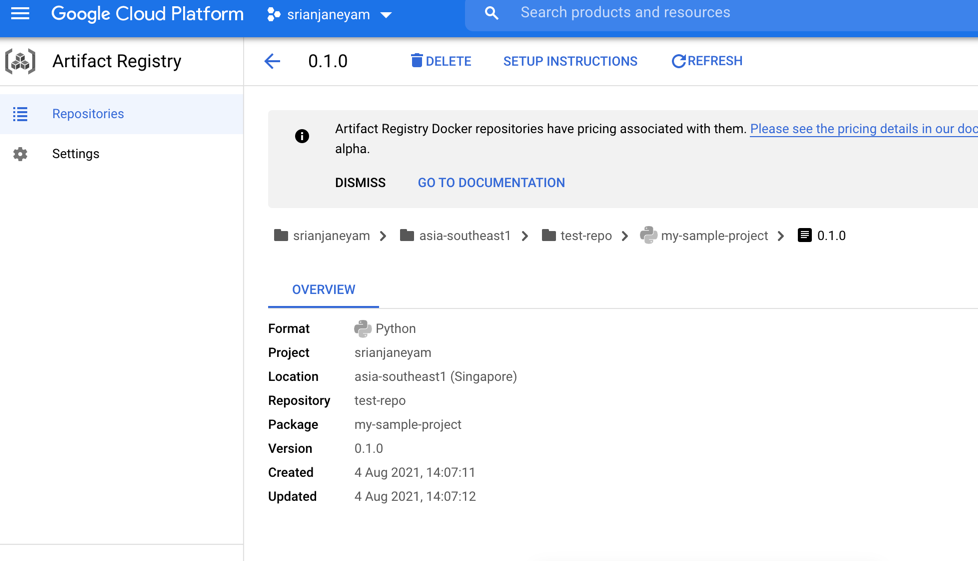

# poetry-gcp-pypi
poetry gcp pypi

#### gcloud auth login
#### pip install keyrings.google-artifactregistry-auth
#### pip install poetry==1.2.0a2

```shell
bharathdasaraju@MacBook-Pro poetry-gcp-pypi (main) $ pip install keyrings.google-artifactregistry-auth
bharathdasaraju@MacBook-Pro poetry-gcp-pypi (main) $ pip install poetry==1.2.0a2
bharathdasaraju@MacBook-Pro poetry-gcp-pypi (main) $
```


```shell
bharathdasaraju@MacBook-Pro poetry-gcp-pypi (main) $ poetry init

This command will guide you through creating your pyproject.toml config.

Package name [poetry-gcp-pypi]:  my-sample-project
Version [0.1.0]:
Description []:  
Author [bharath <bhrth.dsra1@gmail.com>, n to skip]:  
License []:  
Compatible Python versions [^3.9]:  

Would you like to define your main dependencies interactively? (yes/no) [yes] no
Would you like to define your development dependencies interactively? (yes/no) [yes] no
Generated file

[tool.poetry]
name = "my-sample-project"
version = "0.1.0"
description = ""
authors = ["bharath <bhrth.dsra1@gmail.com>"]
readme = "README.md"
packages = [{include = "my_sample_project"}]

[tool.poetry.dependencies]
python = "^3.9"


[build-system]
requires = ["poetry-core"]
build-backend = "poetry.core.masonry.api"


Do you confirm generation? (yes/no) [yes]  
bharathdasaraju@MacBook-Pro poetry-gcp-pypi (main) $ poetry --version
Poetry (version 1.2.0a2)
bharathdasaraju@MacBook-Pro poetry-gcp-pypi (main) 


```

```shell

bharathdasaraju@MacBook-Pro poetry-gcp-pypi (main) $ poetry config repositories.google https://asia-southeast1-python.pkg.dev/srianjaneyam/test-repo
bharathdasaraju@MacBook-Pro poetry-gcp-pypi (main) $ mkdir my_sample_project
bharathdasaraju@MacBook-Pro poetry-gcp-pypi (main) $ 

bharathdasaraju@MacBook-Pro poetry-gcp-pypi (main) $ touch my_sample_project/__init__.py
bharathdasaraju@MacBook-Pro poetry-gcp-pypi (main) $ touch README.md
bharathdasaraju@MacBook-Pro poetry-gcp-pypi (main) $ poetry publish --build -r google
Creating virtualenv my-sample-project-xIvPYfgY-py3.9 in /Users/bharathdasaraju/Library/Caches/pypoetry/virtualenvs
Building my-sample-project (0.1.0)
  - Building sdist
  - Built my-sample-project-0.1.0.tar.gz
  - Building wheel
  - Built my_sample_project-0.1.0-py3-none-any.whl

Publishing my-sample-project (0.1.0) to google
 - Uploading my-sample-project-0.1.0.tar.gz 100%
 - Uploading my_sample_project-0.1.0-py3-none-any.whl 100%
bharathdasaraju@MacBook-Pro poetry-gcp-pypi (main) $ 

```




### use uploaded package in second_project

```shell
bharathdasaraju@MacBook-Pro poetry-gcp-pypi (main) $ cd second_project/

bharathdasaraju@MacBook-Pro second_project (main) $ cat pyproject.toml 
[tool.poetry]
name = "secondary-project"
version = "0.1.0"
description = ""
authors = ["bharath <bhrth.dsra1@gmail.com>"]
readme = "README.md"

[tool.poetry.dependencies]
python = "^3.9"
my-sample-project = "^0.1.0"

[build-system]
requires = ["poetry-core"]
build-backend = "poetry.core.masonry.api"

[[tool.poetry.source]]
name = "google"
url = "https://asia-southeast1-python.pkg.dev/srianjaneyam/test-repo/simple"
bharathdasaraju@MacBook-Pro second_project (main) $


bharathdasaraju@MacBook-Pro second_project (main) $ poetry add my-sample-project
Creating virtualenv secondary-project-uIi-1zLL-py3.9 in /Users/bharathdasaraju/Library/Caches/pypoetry/virtualenvs
Using version ^0.1.0 for my-sample-project

Updating dependencies
Resolving dependencies... (1.1s)

Writing lock file

Package operations: 1 install, 0 updates, 0 removals

  • Installing my-sample-project (0.1.0)
bharathdasaraju@MacBook-Pro second_project (main) $ 

```
